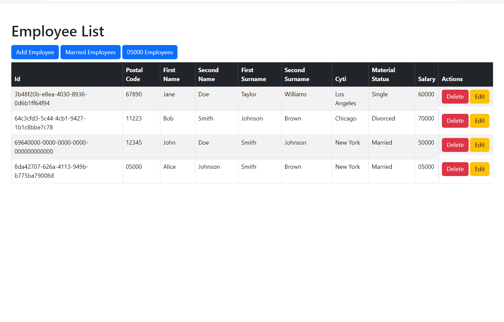

# Crud Customer | Clientes
es un proyecto de CRUD de clientes, donde se puede crear, leer, actualizar y eliminar clientes.

## Tecnologías
- java
- spring boot
- Thymeleaf
- bootstrap
- maven
- mysql




## .Application.properties

normalmente por defecto esta:   
pero cambie por: 

````
spring:
  application:
    name: sem6
  datasource:
    url: jdbc:mysql://localhost:3306/sem6
    username: root
    password: root
  jpa:
    hibernate:
      ddl-auto: update
    show-sql: true
  thymeleaf:
    prefix: classpath:/templates/
    suffix: .html

server:
  port: 8090
````

**ya puedes comenzar a usar el proyecto** 
de aqui para adelante es extra

# Extra


## Entidad
````
@Entity
public class Customer {
    @Id
    @GeneratedValue(strategy = GenerationType.IDENTITY)
    private Long id;
    private String name;
    private String email;
    private String phone;
    private String address;
}
````

## UsO DE GET y POST en HTML
En HTML, los formularios solo admiten los métodos GET y POST. Aunque algunas operaciones, como la eliminación de un recurso, normalmente se harían con una solicitud DELETE en una API REST, no podemos usar el método DELETE en un formulario HTML.  Por lo tanto, en su lugar, utilizamos el método POST para enviar la solicitud al servidor. Luego, en el servidor, tratamos esta solicitud POST como una solicitud DELETE. Este es un enfoque común para superar las limitaciones de los formularios HTML.  Por ejemplo, para eliminar un cliente, utilizamos el siguiente código:

````
<form th:action="@{/delete/{id}(id=${customer.id})}" method="post">
    <button type="submit" class="btn btn-danger">Delete</button>
</form>
````
Y en el servidor, manejamos esta solicitud con el siguiente método

````
@PostMapping("/delete/{id}")
public String deleteCustomer(@PathVariable UUID id) {
    sCustomer.deleteCustomerById(id);
    return "redirect:/";
}
````
Aunque estamos utilizando @PostMapping, estamos realizando una operación de eliminación.

⭐⭐⭐⭐⭐
